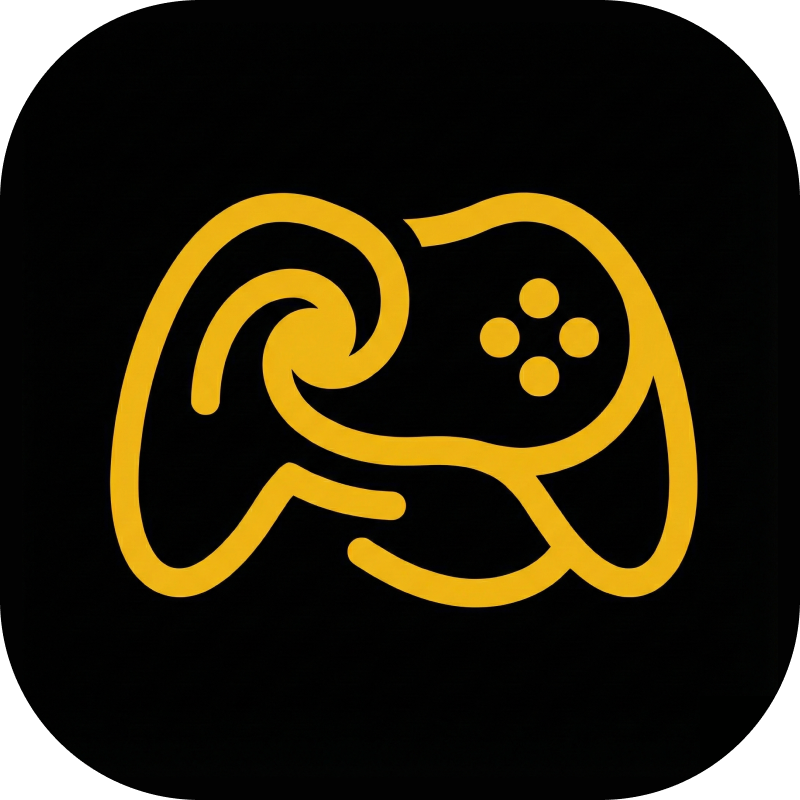

<div align="center">
  
  <h1>Nebula Console</h1>
</div>

**Nebula Console** is a web-based local multiplayer gaming platform that turns your browser into a console and your smartphone into a controller. 

Built with modern web technologies, it offers a seamless, low-latency gaming experience without the need for app downloads or specialized hardware. Just scan a QR code (or enter a room code) and play!

## 🎮 Features

*   **Zero-Install Controllers:** Use any smartphone with a web browser as a gamepad.
*   **Real-Time Multiplayer:** Low-latency communication using Socket.IO.
*   **Diverse Game Library:**
    *   **Neon Soccer:** A fast-paced, physics-based soccer game with power-ups.
    *   **Neon Snake:** A competitive multiplayer twist on the classic Snake.
    *   **Siege Tanks:** (In Development) Tactical tank warfare.
*   **Adaptive Controls:** Controllers automatically adjust their layout based on the active game (Joystick, D-Pad, Buttons).
*   **Responsive Design:** Beautiful, neon-themed UI powered by Tailwind CSS.

## 🛠️ Tech Stack

*   **Frontend (Host & Controller):** React, Vite, Tailwind CSS, Phaser 3 (Game Engine).
*   **Backend:** Node.js, Express, Socket.IO.
*   **Communication:** WebSockets (Socket.IO) for real-time state synchronization.

## 🚀 Getting Started

### Prerequisites

*   [Node.js](https://nodejs.org/) (v16 or higher)
*   [npm](https://www.npmjs.com/)

### Installation

1.  **Clone the repository:**
    ```bash
    git clone https://github.com/yourusername/nebula-console.git
    cd nebula-console
    ```

2.  **Install Server Dependencies:**
    ```bash
    cd server
    npm install
    ```

3.  **Install Client Dependencies:**
    ```bash
    cd ../client
    npm install
    ```

### Running Locally

You need to run both the backend server and the frontend client.

1.  **Start the Server:**
    Open a terminal in the `server` directory:
    ```bash
    npm start
    ```
    *The server usually runs on port 3001.*

2.  **Start the Client:**
    Open a new terminal in the `client` directory:
    ```bash
    npm run dev
    ```
    *The client usually runs on http://localhost:5173.*

3.  **Play!**
    *   Open the Client URL on your Desktop/TV (Host).
    *   Click **"Create Room"**.
    *   Open the Client URL on your Phone (or open a new tab).
    *   Click **"Controller"**, enter the **Room Code**, and join!

## 📂 Project Structure
```
nebula-console/
├── client/                 # Frontend (React + Vite)
│   ├── src/
│   │   ├── controller/     # Mobile Controller UI & Logic
│   │   ├── games/          # Phaser Game Scenes (Soccer, Snake, etc.)
│   │   ├── host/           # Host/TV Screen UI
│   │   ├── context/        # Socket Context & Global State
│   │   └── constants.js    # Client-side Constants (ESM)
│   └── ...
├── server/                 # Backend (Node.js + Socket.IO)
│   ├── index.js            # Entry point
│   ├── socket.js           # Socket event handlers
│   ├── roomManager.js      # Room & Player state management
│   └── constants.js        # Server-side Constants (CJS)
```

## 🤝 Contributing

We welcome contributions! Whether it's adding a new game, fixing a bug, or improving the UI, your help is appreciated.

Please read our [CONTRIBUTING.md](CONTRIBUTING.md) for details on our code of conduct and the process for submitting pull requests.

## 📄 License

This project is licensed under the MIT License - see the [LICENSE](LICENSE) file for details.
